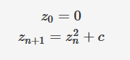
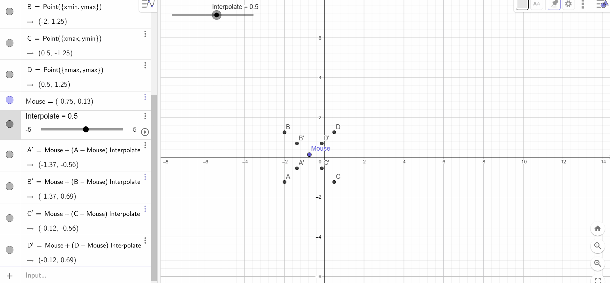
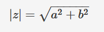

# mandelbrot

Mandelbrot fractal's visualizer with pygame library. 

**Pre-requesite:**
- python (> 3)
- pygame

```
python main.py
```

---------------------------------------------------

## Summary
- [Params](#params)
- [Usage](#usage)
    - [Draw fractal](#draw)
    - [Zoom fractal](#zoom)
- [Theory](#theory)
    - [Mandelbrot set definition](#mandelbrot-set)
    - [How to draw Mandelbrot fractal ?](#how-draw-fractal)
    - [How works the zoom ?](#how-works-zoom)


---------------------------------------------------

<div id="params">

## Params
In main.py you can change parameters for instance "color" (in RGB) for fractal color, "size" for window size.
```
PARAMS_ = {
    "color": [FRACTAL_COLOR], 
    "backgroundColor": [BACKGROUND_COLOR], 
    "size": [WINDOW_SIZE], 
    "coords": [COORDINATES_COMPLEX_PLANE], 
    "zoomfactor": [ZOOM_LEVEL]
}
```
</div>

---------------------------------------------------


<div id="usage">

## Usage

<div id="draw">

### Draw fractal

**Params**
```py
PARAMS_ = {
    "color": (0, 0, 0), 
    "backgroundColor": (0, 0, 255), 
    "size": (600, 600), 
    "coords": (-2, 0.5, -1.25, 1.25), 
    "zoomfactor": 2
}
```
</div>


---

<div id="zoom">

### Zoom fractal
You can zoom with left click mouse,


and dezoom with right click mouse.


</div>
</div>

---------------------------------------------------

<div id="theory">

## Theory

<div id="mandelbrot-set">

### Mandelbrot set definition

Mandelbrot set is a fractal that is defined like the c points set of the complex plane for which sequence is defined by : 



and this sequence not tends to infinity in modulus.

(see [Complex numbers](https://www.mathsisfun.com/numbers/complex-numbers.html)).
<div>

---

<div id="how-draw-fractal">

### How to draw Mandelbrot fractal ?

For each x (length) and y (height) coordinate, these coordinates are transformed to the complex plane. (see [complex_transform](#complex_transform))

- cx is the real part of the complex number
- cy is the imaginary part of the complex number

With cx and cy, we form the complex number using the function ``complex(cx,cy)`` and define it in the variable c.

Then we set the sequence z to 0 which is the initial term and in the loop, as long as the square of the components of z is less than 4 (see [modulus](#modulus)) and the iteration is less than **MAX_ITERATION**, we calculate the next term of the sequence ``(z = z^2 + c)``.


```py
for x in range(self.width):
    for y in range(self.height):
        i = 0

        # ...

        cx = self.complex_transform(x, self.width, self.xmax, self.xmin)
        cy = self.complex_transform(y, self.width, self.ymax, self.ymin)
        c = complex(cx, cy)
        z = 0

        while (z.imag**2 + z.real**2 < 4) and i < self.max_iteration:
            z = z**2 + c
            i+=1
```

If i is equal to **MAX_ITERATION**, the coordinates (x,y) are part of the Mandelbrot set, we draw a pixel with these coordinates according to the color defined in ``__PARAMS["color"]`` otherwise if it is not part of the Mandelbrot set, we draw the pixel of a different color (according to ``_PARAMS["backgroundColor"]``.

**Colours can be varied with iterations**. 

```py
if i == self.max_iteration:
    self.window.set_at((x, y), self.color)
else:
    self.window.set_at((x, y), (i * self.backgroundColor[0] / self.max_iteration, i * self.backgroundColor[1] / self.max_iteration, i * self.backgroundColor[2] / self.max_iteration))
```


</div>

---

<div id="how-works-zoom">

### How works the zoom ?

To zoom in, we retrieve the coordinates of the region where we clicked with the mouse and convert these coordinates to the complex plane (see [complex_transform](#complex_transform)) because we need a complex point to use it with the interpolate function.

```py
mouseRealPart = self.complex_transform(pos[0], self.width, self.xmax, self.xmin)

mouseImaginaryPart = self.complex_transform(pos[1], self.height, self.ymax, self.ymin)
```

**interpolate**

interpolate allows you to move from one complex point to another complex point to define the new coordinates xmin,xmax,ymin,ymax by zooming or unzooming. (see [set_interpolation](#set_interpolation))

```py
def interpolate(self, start, end, interpolation):
    return start + ((end - start) * interpolation)
```

``end-start`` : Distance between the mouse coordinate and the edge of xmin or xmax or ymin or ymax.

``((end - start) * interpolation)`` : Multiply this distance difference by the zoom factor

``start + ((end - start) * interpolation)`` : We add **start** to refocus **((end - start) * interpolation)** to refocus it.

**Geogebra simulation**

Link to download the file: [here](assets/example_interpolate.ggb)




</div>


</div>

---

## See

<div id="complex_transform">


### complex_transform

This function allows to convert a window pixel over complex complex plane.

```py
def complex_transform(self, grid_position, size, max, min):
    return min + (grid_position * ((max - min) / size))
```

- ``(max-min)`` : Visible distance in the complex plane.
- ``size`` : Pixel's number.
- ``((max-min)/size)`` : Pixel size on the complex plane.
- ``grid_position`` : Pixel's number of offset.
- ``(grid_position * ((max - min) / size))`` : Multiply **grid_position** by **((max - min) / size))** to convert **grid_position** to the complex plane. **grid_position** is no longer a pixel but a number which it's equivalent on the complex plane.

- ``min + (grid_position * ((max - min) / size))`` : **min** refocus on the origin of the complex plane else he will refocus in (0,0) coordinates, so in top-left corner.

**For real part:**
```py
self.complex_transform(x, self.width, self.xmax, self.xmin)
```


**For imaginary part:**
```py
self.complex_transform(y, self.width, self.ymax, self.ymin)
```


</div>

---

<div id="modulus">

### modulus

Modulus is distance between origin and complex point. 



In loop while, (z.imaz\**2 + z.real**2 < 4) is same to abs(z) < 2
```py
while (z.imag**2 + z.real**2 < 4) and i < self.max_iteration:
    z = z**2 + c
    i+=1
```

> abs(z) = sqrt(z.imag\**2 + z.real**2)

---

<div id="set_interpolation">

### set_interpolation

```py
def set_interpolation(self, zoomtype):
    return (1.0 / self.zoomfactor) if zoomtype == 1 else (1.0 * self.zoomfactor)
```

set_interpolation is a function to calculate zoom factor according to ``zoomfactor`` parameter in ``_PARAMS``.

If zoomtype is equal to 1, it's left click mouse so the program zoom in else it's right click mouse so the program zoom out.

- We divide 1 by zoomfactor for zoom in because the zoom in is between 0 and 1.

- We multiply 1 by zoomfactor for zoom out because the zoom out is between 1 and infinity.

</div>


